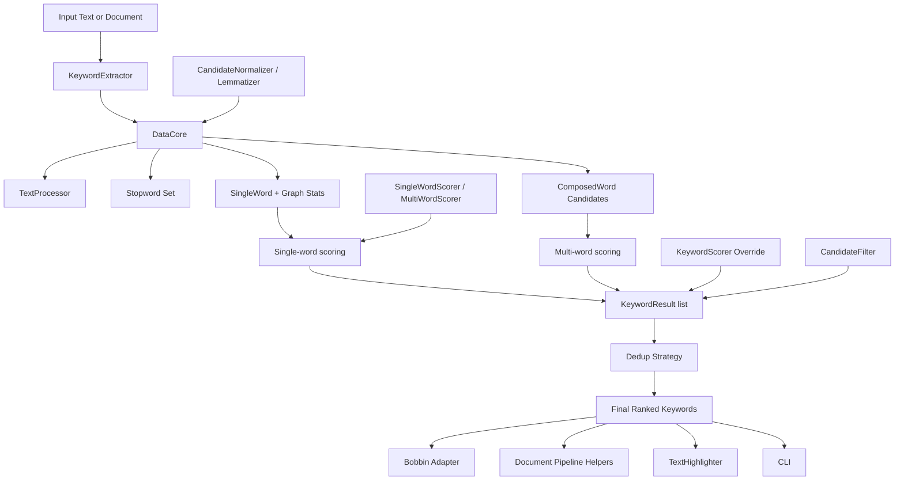

# Yaket Architecture

`Yaket` is organized as a small extraction core plus optional adapter layers for pipelines, documentation-oriented utilities, and benchmarking.

## Goals

1. Preserve upstream YAKE core behavior as closely as practical.
2. Keep the extraction path portable across Node, browser-style bundles, and Cloudflare Workers.
3. Make extension points explicit and typed.
4. Keep Bobbin-specific adoption logic out of the extraction core.

## High-Level Diagram



## ASCII Diagram

The same architecture rendered for environments without Mermaid support.

```
                                YAKET ARCHITECTURE
                                ==================

┌─────────────────────────────────────────────────────────────────────────────────┐
│                            PUBLIC ENTRY POINTS                                  │
│  extract() / extractKeywords()      one-shot pure-function API                  │
│  extractKeywordDetails()            returns rich KeywordResult records          │
│  new KeywordExtractor(opts)         reusable instance                           │
│  createKeywordExtractor({...})      composition-style constructor               │
│                                                                                 │
│  Package exports (package.json):                                                │
│    "@ade_oshineye/yaket"          ──┐                                           │
│    "@ade_oshineye/yaket/browser"  ──┼─► same ESM bundle, edge-safe              │
│    "@ade_oshineye/yaket/worker"   ──┘                                           │
└────────────────────────────────────┬────────────────────────────────────────────┘
                                     ▼
┌─────────────────────────────────────────────────────────────────────────────────┐
│                EXTRACTION CORE (edge-safe — no fs/path/child_process)           │
│                                                                                 │
│   src/KeywordExtractor.ts  ── option normalization, alias handling,             │
│   ┌──────────────────┐         result shaping, dedup orchestration,             │
│   │ KeywordExtractor │         extension-hook wiring                            │
│   └────────┬─────────┘                                                          │
│            ▼                                                                    │
│   ┌──────────────────┐  src/DataCore.ts                                         │
│   │    DataCore      │  ── preprocess text                                      │
│   │                  │  ── build sentences / token blocks                       │
│   │                  │  ── maintain co-occurrence graph (src/graph.ts)          │
│   │                  │  ── feed feature accumulators                            │
│   └─────┬──────┬─────┘                                                          │
│         ▼      ▼                                                                │
│  ┌──────────┐ ┌────────────┐                                                    │
│  │SingleWord│ │ComposedWord│  src/SingleWord.ts  → unigram features + score     │
│  │  terms   │ │ candidates │  src/ComposedWord.ts → n-gram validation + score   │
│  └────┬─────┘ └─────┬──────┘                                                    │
│       └──────┬──────┘                                                           │
│              ▼                                                                  │
│   ┌─────────────────────┐  YAKE local-feature scoring:                          │
│   │  YAKE local-feature │  frequency · spread · position · casing ·             │
│   │       scoring       │  relatedness (graph-derived)                          │
│   └──────────┬──────────┘                                                       │
│              ▼                                                                  │
│   ┌─────────────────────┐  { keyword, normalizedKeyword, score,                 │
│   │   KeywordResult[]   │    ngramSize, occurrences, sentenceIds }              │
│   └──────────┬──────────┘                                                       │
│              ▼                                                                  │
│   ┌─────────────────────┐  src/similarity.ts                                    │
│   │   Dedup strategy    │  seqm  (default, segtok-flavored heuristic)           │
│   │                     │  levs  (Levenshtein)                                  │
│   │                     │  jaro  (Jaro)                                         │
│   └──────────┬──────────┘  + bounded similarity caches                          │
│              ▼                                                                  │
│       Final ranked keywords                                                     │
└────────────────────────────────────┬────────────────────────────────────────────┘
                                     ▼
       ┌─────────────────────────────┼──────────────────────────┐
       ▼                             ▼                          ▼
┌──────────────────┐     ┌──────────────────────┐    ┌─────────────────────┐
│  ADAPTER LAYER   │     │  PIPELINE HELPERS    │    │   PRESENTATION      │
│ src/bobbin.ts    │     │ src/document.ts      │    │ src/highlight.ts    │
│ extractYakeKeywords│   │ extractFromDocument  │    │ TextHighlighter     │
│ → Bobbin-shaped  │     │ + beforeExtractText  │    │                     │
│   {keyword,score}│     │ + afterExtractKeywords│   │ src/cli.ts          │
│ thin so Bobbin   │     │ + serialize helpers  │    │ `yaket` Node CLI    │
│ policy stays out │     │ document-centric,    │    │ (Node-only,         │
│ of core          │     │ topic-system-free    │    │  separated from     │
│                  │     │                      │    │  edge-safe core)    │
└──────────────────┘     └──────────────────────┘    └─────────────────────┘

┌─────────────────────────────────────────────────────────────────────────────────┐
│                      EXTENSION POINTS  (src/strategies.ts)                      │
│  TextProcessor          tokenize + sentence-split (Worker-safe interface)       │
│  SentenceSplitter       split(text) → string[]                                  │
│  Tokenizer              tokenize(text) → string[]                               │
│  StopwordProvider       load(language) → Set<string>                            │
│  SimilarityStrategy     compare(a,b) → number                                   │
│  CandidateNormalizer    casing / plural / punctuation policy                    │
│  Lemmatizer             hook only (no bundled spacy/nltk backends)              │
│  SingleWordScorer       replace internal YAKE unigram score                     │
│  MultiWordScorer        replace internal YAKE n-gram score                      │
│  KeywordScorer          override final ranking score                            │
│  candidateFilter        boundary / stopword / tag policy                        │
└─────────────────────────────────────────────────────────────────────────────────┘

┌─────────────────────────────────────────────────────────────────────────────────┐
│                STOPWORDS  (src/stopwords.ts + .generated.ts)                    │
│  bundledStopwordTexts / STOPWORDS    frozen map of raw text per 2-letter key    │
│  loadStopwords(lang)                 default loader, falls back to "noLang"     │
│  createStopwordSet(lang, {add,remove,replace})                                  │
│  createStaticStopwordProvider({...}) build a custom StopwordProvider            │
│  supportedLanguages                  34 bundled: ar bg br cz da de el en es     │
│                                      et fa fi fr hi hr hu hy id it ja lt lv     │
│                                      nl no pl pt ro ru sk sl sv tr uk zh        │
└─────────────────────────────────────────────────────────────────────────────────┘

┌─────────────────────────────────────────────────────────────────────────────────┐
│                          VERIFICATION LAYERS                                    │
│  golden fixtures · Python parity (test/python-parity.test.ts) · property tests  │
│  (fast-check) · mutation/fuzz tests · CLI coverage · Cloudflare runtime tests   │
│  (@cloudflare/vitest-pool-workers) · package smoke · docs-sync · Bobbin         │
│  regression · Stryker mutation testing · benchmarks vs Python YAKE/Bobbin/TF-IDF│
└─────────────────────────────────────────────────────────────────────────────────┘

Runtime boundary key:
  EDGE-SAFE   no fs / path / child_process / native bindings
  NODE-ONLY   src/cli.ts, scripts/benchmark.ts (kept out of import graph)
```

## Module Map

| Module | Responsibility |
|---|---|
| `src/KeywordExtractor.ts` | Public extraction API, result shaping, dedup, extension hooks |
| `src/DataCore.ts` | Document state, candidate generation, co-occurrence graph, feature preparation |
| `src/SingleWord.ts` | Single-word feature accumulation and scoring |
| `src/ComposedWord.ts` | Multi-word candidate validation and scoring |
| `src/utils.ts` | Pre-filtering, sentence splitting, tokenization, YAKE tag logic |
| `src/similarity.ts` | Levenshtein, sequence, Jaro similarity, configurable `SimilarityCache` |
| `src/stopwords.ts` | Bundled stopword loading |
| `src/strategies.ts` | Pluggable strategy and result interfaces (incl. `SentenceSplitter` and `Tokenizer`) |
| `src/document.ts` | Document-oriented pipeline helpers |
| `src/bobbin.ts` | Bobbin-compatible adapter output |
| `src/highlight.ts` | Keyword highlighting utility |
| `src/graph.ts` | Adjacency-backed co-occurrence graph |
| `src/cli.ts` | Optional Node CLI entry point |
| `scripts/benchmark.ts` | Komoroske corpus benchmark harness (Node-only) |
| `scripts/benchmark-multilingual.ts` | Per-language Yaket-vs-Python YAKE parity benchmark (Node-only) |
| `scripts/benchmark-datasets.ts` | Inspec/SemEval-style dataset benchmark (Node-only) |
| `scripts/bundle-size.ts` | Worker-target bundle-size reporter (esbuild, Node-only) |

## Extraction Flow

1. `KeywordExtractor` normalizes options and loads stopwords.
2. `DataCore` preprocesses text and builds sentence/token blocks.
3. Tokens become `SingleWord` terms stored in an adjacency-backed graph.
4. Candidate phrases become `ComposedWord` values.
5. YAKE single-word and multi-word scores are computed.
6. Results are converted into typed `KeywordResult` records.
7. Dedup and result truncation are applied.
8. Optional adapters reshape output for Bobbin or document pipelines.

## Runtime Boundaries

### Extraction core

The extraction core is intentionally free of Node-only runtime dependencies. That includes:

- no runtime `fs` reads for stopwords
- no `path` or `child_process` in the extraction path
- no native bindings

### Node-only surfaces

These remain optional and separate:

- `src/cli.ts`
- `scripts/benchmark.ts`

## Extension Points

`Yaket` currently exposes these extension points:

- `TextProcessor` (combined sentence-split + tokenize)
- `SentenceSplitter` (just sentence split, override one half independently)
- `Tokenizer` (just tokenize, override one half independently)
- `StopwordProvider`
- `SimilarityStrategy`
- `SimilarityCache` (configurable bounded cache for `seqm` / `levs` memoization)
- `CandidateNormalizer`
- `Lemmatizer`
- `SingleWordScorer`
- `MultiWordScorer`
- `KeywordScorer`
- `candidateFilter`

The default behavior remains YAKE-like. Extensions are for integration and experimentation, not for replacing the full core pipeline casually.

Package consumers install Yaket from npm as `@ade_oshineye/yaket`.

## Testing Layers

The current architecture is verified through multiple test layers:

- golden fixtures
- Python parity checks (English fixtures)
- multilingual parity checks (`test/multilingual-parity.test.ts` locking head-parity heads against upstream YAKE 0.7.x for `pt`, `de`, `es`, `it`, `fr`, `nl`, `ru`, `ar`)
- multilingual corpus parity (`test/multilingual-corpus.test.ts` covering 21 documents across 7 languages with 168/210 head slots locked vs upstream)
- bundle-size guardrail (`test/bundle-size.test.ts` asserts the worker-target gzipped bundle stays inside a documented edge budget and contains no Node built-ins)
- property-based tests including PBT invariants exercised across bundled languages (no-throw on arbitrary unicode, determinism, top-bound)
- canonical-only options tests asserting the 0.6 alias removal at type and runtime level
- mutation-style fuzz tests
- dedicated CLI coverage checks
- Cloudflare Worker runtime tests
- package-surface smoke tests
- docs-sync tests
- Bobbin-style regression tests
- benchmark comparisons against Bobbin, TF-IDF, and Python YAKE (Komoroske, multilingual, Inspec/SemEval-style datasets)
- mutation testing on scoring and dedup modules

## Non-Goals

The current architecture does not try to:

1. become a corpus topic-modeling system
2. absorb Bobbin's topic taxonomy and entity heuristics into the core
3. provide production-grade multilingual lemmatization yet
