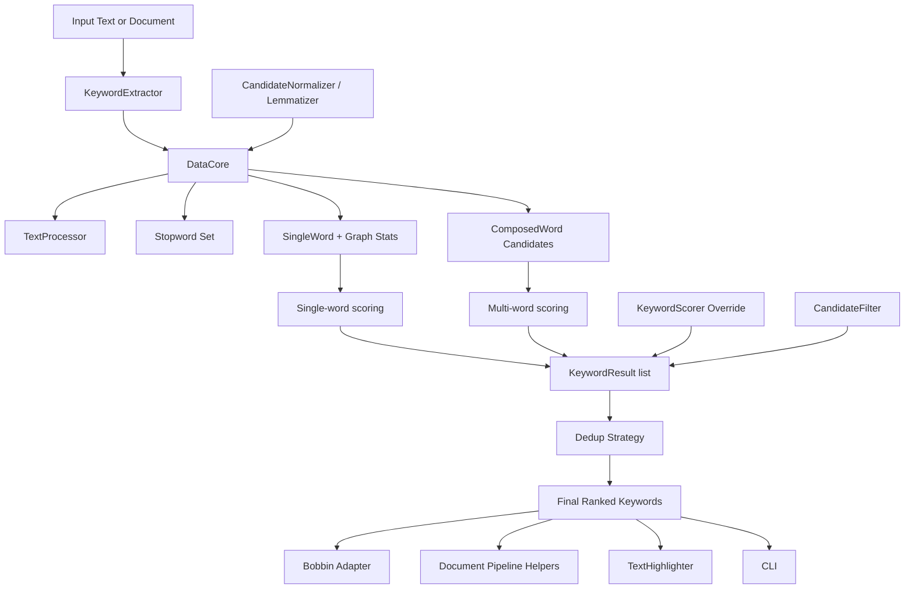

# Yaket Architecture

`Yaket` is organized as a small extraction core plus optional adapter layers for pipelines, documentation-oriented utilities, and benchmarking.

## Goals

1. Preserve upstream YAKE core behavior as closely as practical.
2. Keep the extraction path portable across Node, browser-style bundles, and Cloudflare Workers.
3. Make extension points explicit and typed.
4. Keep Bobbin-specific adoption logic out of the extraction core.

## High-Level Diagram

## Module Map

| Module | Responsibility |
|---|---|
| `src/KeywordExtractor.ts` | Public extraction API, result shaping, dedup, extension hooks |
| `src/DataCore.ts` | Document state, candidate generation, co-occurrence graph, feature preparation |
| `src/SingleWord.ts` | Single-word feature accumulation and scoring |
| `src/ComposedWord.ts` | Multi-word candidate validation and scoring |
| `src/utils.ts` | Pre-filtering, sentence splitting, tokenization, YAKE tag logic |
| `src/similarity.ts` | Levenshtein, sequence, Jaro similarity, cache diagnostics |
| `src/stopwords.ts` | Bundled stopword loading |
| `src/strategies.ts` | Pluggable strategy and result interfaces |
| `src/document.ts` | Document-oriented pipeline helpers |
| `src/bobbin.ts` | Bobbin-compatible adapter output |
| `src/highlight.ts` | Keyword highlighting utility |
| `src/cli.ts` | Optional Node CLI entry point |

## Extraction Flow

1. `KeywordExtractor` normalizes options and loads stopwords.
2. `DataCore` preprocesses text and builds sentence/token blocks.
3. Tokens become `SingleWord` terms stored in an adjacency-backed graph.
4. Candidate phrases become `ComposedWord` values.
5. YAKE single-word and multi-word scores are computed.
6. Results are converted into typed `KeywordResult` records.
7. Dedup and result truncation are applied.
8. Optional adapters reshape output for Bobbin or document pipelines.

## Runtime Boundaries

### Extraction core

The extraction core is intentionally free of Node-only runtime dependencies. That includes:

- no runtime `fs` reads for stopwords
- no `path` or `child_process` in the extraction path
- no native bindings

### Node-only surfaces

These remain optional and separate:

- `src/cli.ts`
- `scripts/benchmark.ts`

## Extension Points

`Yaket` currently exposes these extension points:

- `TextProcessor`
- `StopwordProvider`
- `SimilarityStrategy`
- `CandidateNormalizer`
- `Lemmatizer`
- `KeywordScorer`
- `candidateFilter`

The default behavior remains YAKE-like. Extensions are for integration and experimentation, not for replacing the full core pipeline casually.

## Testing Layers

The current architecture is verified through multiple test layers:

- golden fixtures
- Python parity checks
- property-based tests
- mutation-style fuzz tests
- dedicated CLI coverage checks
- Cloudflare Worker runtime tests
- package-surface smoke tests
- docs-sync tests
- Bobbin-style regression tests
- benchmark comparisons against Bobbin, TF-IDF, and Python YAKE
- mutation testing on scoring and dedup modules

## Non-Goals

The current architecture does not try to:

1. become a corpus topic-modeling system
2. absorb Bobbin's topic taxonomy and entity heuristics into the core
3. provide production-grade multilingual lemmatization yet
